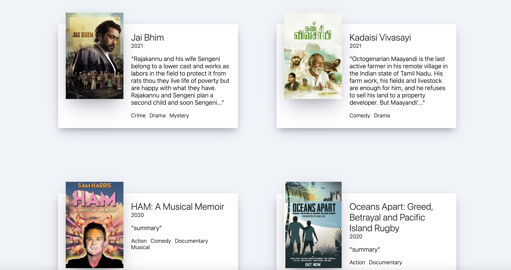
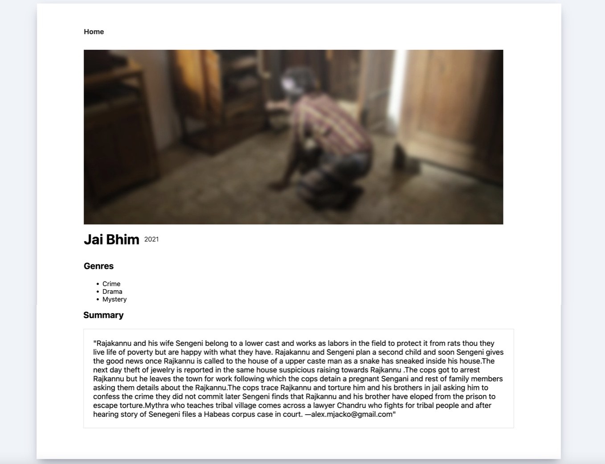

# 1. React for Beginner-2022

| Feature     | Image                                      |
| ----------- | ------------------------------------------ |
| Home Page   |     |
| Detail Page |   |

- ## <배운이론 및 기술>

- - [x]  pug 사용
       
        - extends로 상속하여 코드 반복 방지
        - partials을 통해 코드 반복 방지
        - mixin을 사용하여 코드 반복 방지
  ---

  - - [x]  React란
         
          -  React는 페이스북에서 개발하여 웹에서 상호작용하는 UI를 만들기 위해 사용하는 JavaScript의 Library 이다.
          
          - 웹에서도 사용할수 있고, React-native를 통해 앱으로도 사용할 수 있다.
    ---

## <배운이론 및 기술>
- - [x]  JSX
         
          -  JavaScript의 확장 문법이며 공식 JavaScript문법은 아니지만, babel을 통해 변환하여 사용 할 수 있다. 
          문법 규칙 : 1. 컴포넌트에 여러 요소가 있다면 반드시 부모 요소 하나로 감싸야 한다.
               ex) return ( 
<h1>Hello</h1> <h2>Bye<h2>
) 

                  2. JavaScript 문법을 사용할려면 {}로  감싸서 표현한다. 
                   ex) <h1>Hello {name} </h1>

                  3. 3항 연산자 사용이 가능하다. 
                  ex) {name==='chiman' ? (<h1>CHI MAN</h1>) : (<h1>Anonymous</h1>)} 

                     
- - [x]  State
         
          
          - State : 변수 대신 사용하는 데이터의 저장 공간이며 데이터가 변경되면, 자동으로 Re Render하여 새로고침 없이 동작시킬 수 있다.
        
        사용방법
        1. React 라이브러리에 있는 useState()를 사용하며, 초기값을 설정해준다.
        ex) const [state, setState] = useState(0) 

        2. Event를 사용하여, state의 변화를 setState에 저장해준다.
        ex) const onClick = () => {setState(state+1)};

        3. 원하는곳에 사용해준다.
        ex) <button>onClick={onClick}<button> 
    ---

- - [x]  Props    
 
          - Props : properties의 줄임말으로서 부모컴포넌트로 부터 자식 컴포넌트에 데이터를 보낼 수 있는 방법이다. 함수에서 인자를 보내는것 과 비슷하다.
          style, event , text, boolean 많은것들을 props로 보낼 수 있다. 
          같은코드의 일부분만 다를 경우, 복사 붙혀넣기를 계속 하는 대신, props를 사용하면 코드의 반복을 줄일수 있다.

           사용방법
           1. 인자를 보내준다. 
           ex) 
<Button text="Add">

           2. 받은 인자를 통해 사용하길 원하는 곳에 값을 지정해준다. 
            ex-1) function Button(props) {<button>{props.text}</button>}
            ex-2)function Button({text}) {<button>{text}</button>}

   ---

- - [x]  Props    
          - Prop Types : Props로 주는 데이터의 형식을 지정 하여 에러를 방지 할 수 있는 패키지이다.

          - Creat-React-App : React Application을 만들때 가장 좋은 Tool이며 분할 방식 하기에 아주 좋다.

          - useEffect : React가 계속 rerender할때 사용하는 함수로서, API호출이나 중요한 일을 할때와 같이 한번만 코드를 실행 할 수 있으며, 필요에 따라 원하는 요소에 변화에 따라 코드를 실행 할 수 있도록 해준다.

          - Clean Up : useEffect를 사용할때 코드가 Destory될때 작동하는 함수이다. useEffect함수 내에 코드를 실행하고 return 후에 코드를 작성해주면 된다.  

